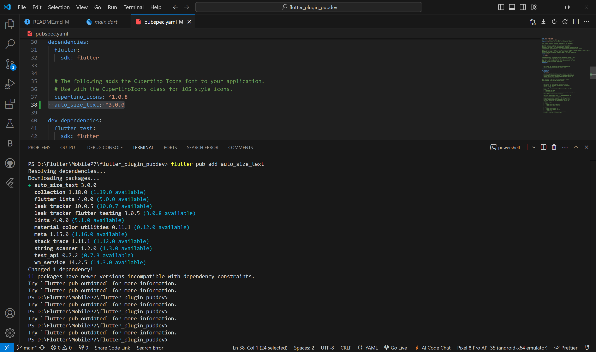
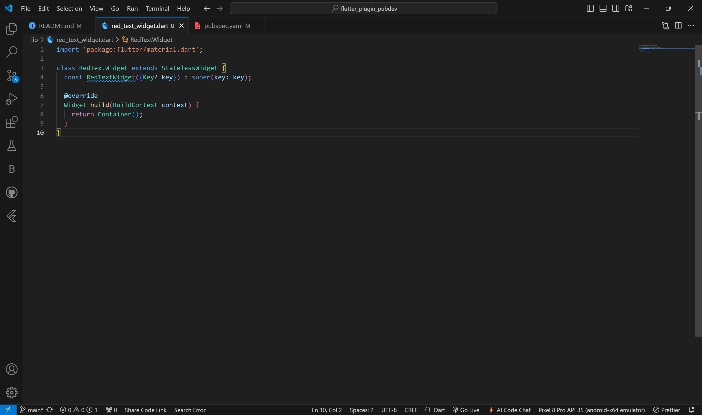
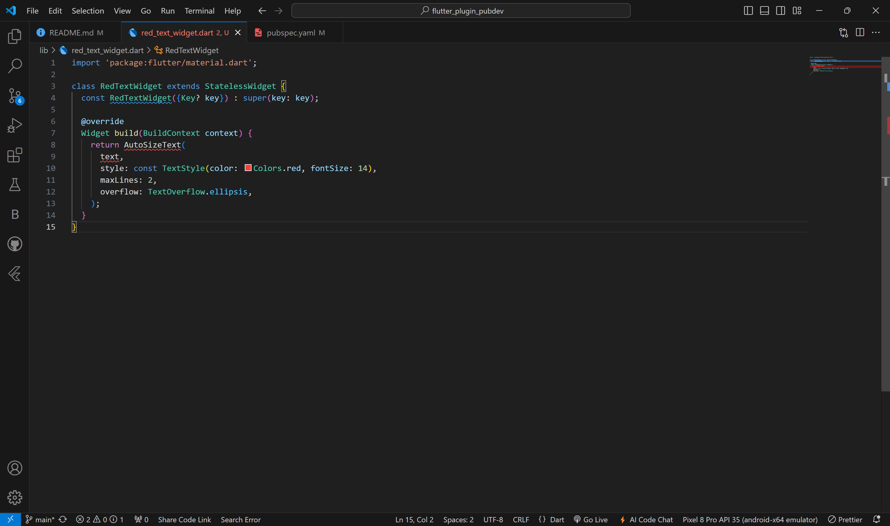
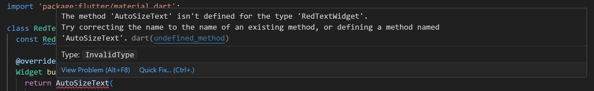
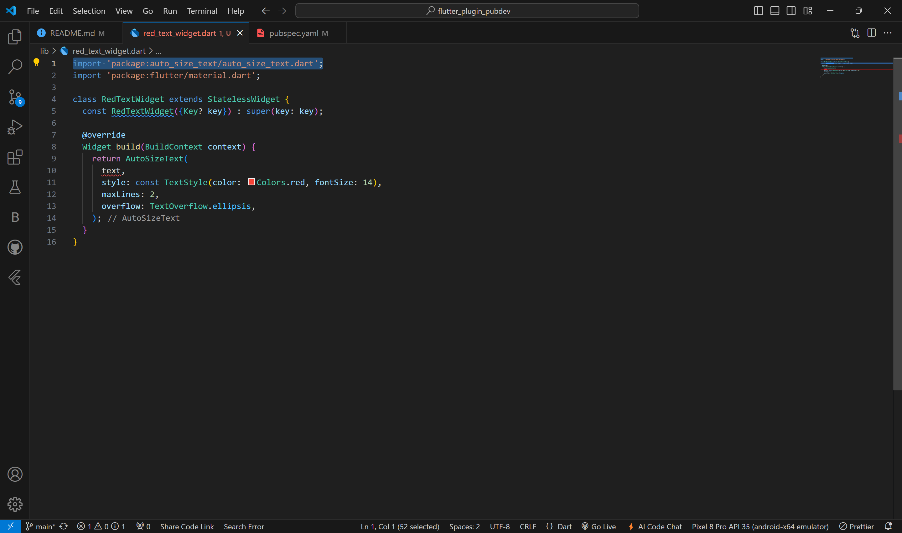
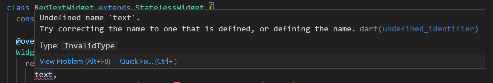
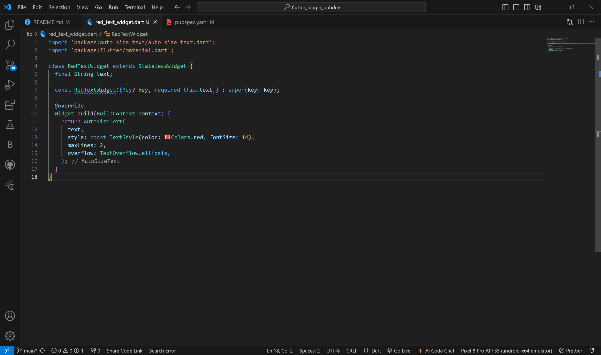
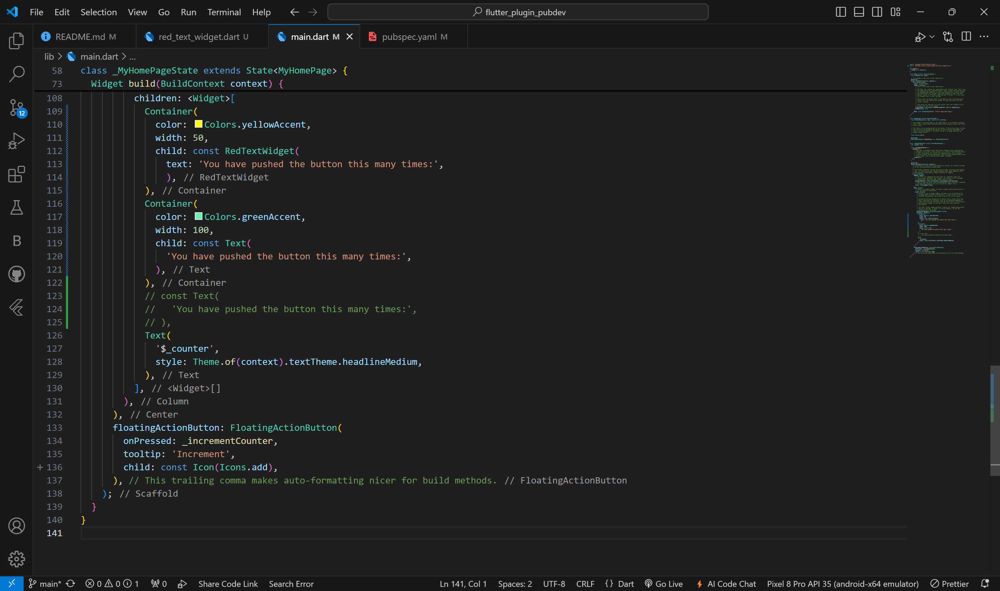
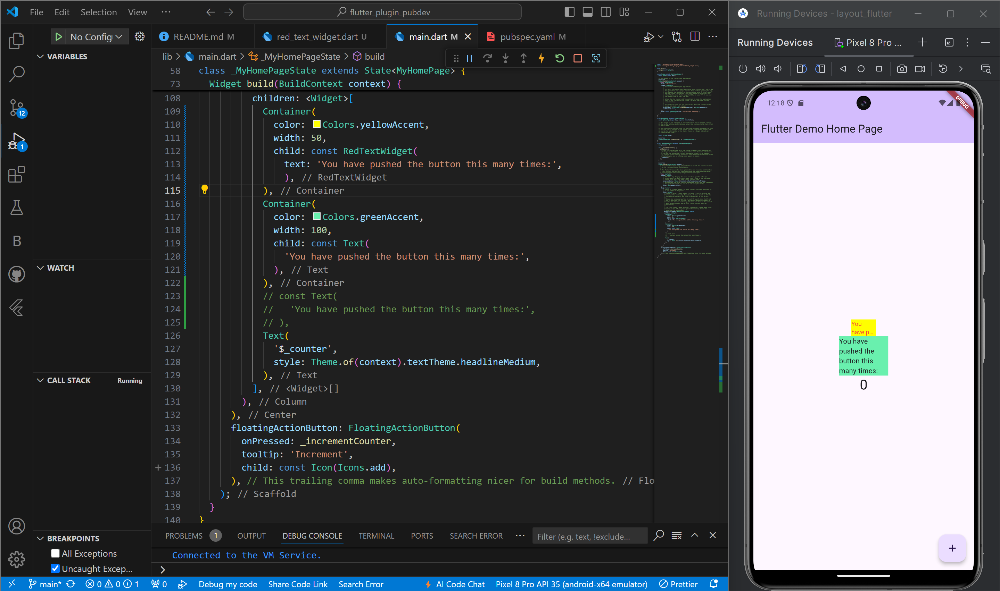

# flutter_plugin_pubdev

A new Flutter project.

## Identitas Mahasiswa

> Nama  : Triyana Dewi Fatmawati <br/>
> NIM   : 2241720206 <br/>
> Kelas : TI - 3H <br/>
> Nomor : 25 <br/>

## Getting Started

# Praktikum 7 : Manajemen Plugin | Menerapkan Plugin di Project Flutter

## Langkah 1: Buat Project Baru
Buatlah sebuah project flutter baru dengan nama **flutter_plugin_pubdev**. Lalu jadikan repository di GitHub Anda dengan nama **flutter_plugin_pubdev**.


## Langkah 2: Menambahkan Plugin
Tambahkan plugin `auto_size_text` menggunakan perintah berikut di terminal <br>
``` dart
flutter pub add auto_size_text
```

Jika berhasil, maka akan tampil nama plugin beserta versinya di file `pubspec.yaml` pada bagian dependencies.

### Pengerjaan :



## Langkah 3: Buat file red_text_widget.dart
Buat file baru bernama `red_text_widget.dart` di dalam folder lib lalu isi kode seperti berikut. <br>
``` dart
import 'package:flutter/material.dart';

class RedTextWidget extends StatelessWidget {
  const RedTextWidget({Key? key}) : super(key: key);

  @override
  Widget build(BuildContext context) {
    return Container();
  }
}
```

### Pengerjaan :



## Langkah 4: Tambah Widget AutoSizeText
Masih di file `red_text_widget.dart`, untuk menggunakan plugin `auto_size_text`, ubahlah kode `return Container()` menjadi seperti berikut.
``` dart
return AutoSizeText(
      text,
      style: const TextStyle(color: Colors.red, fontSize: 14),
      maxLines: 2,
      overflow: TextOverflow.ellipsis,
);
```
Setelah Anda menambahkan kode di atas, Anda akan mendapatkan info error. Mengapa demikian? Jelaskan dalam laporan praktikum Anda!

### Pengerjaan :


### Penjelasan Error :
Penambahan kode pada langkah ini menyebabkan 2 error : <br>
1. Error yang pertama dikarenakan belum meng-import `AutoSizeText'. <br>
 <br>

    Sehingga perlu ditambahkan terlebih dahulu. Seperti pada gambar di bawah ini. <br>
     

2. Error yang kedua dikarenakan variabel `text` belum didefinisikan di dalam class `red_text_widget.dart`.
 <br> 


## Langkah 5: Buat Variabel text dan parameter di constructor
Tambahkan variabel `text` dan parameter di constructor seperti berikut.
``` dart
final String text;

const RedTextWidget({Key? key, required this.text}) : super(key: key);
```

### Pengerjaan :



## Langkah 6: Tambahkan widget di main.dart
Buka file `main.dart` lalu tambahkan di dalam `children:` pada `class _MyHomePageState`
``` dart
Container(
   color: Colors.yellowAccent,
   width: 50,
   child: const RedTextWidget(
             text: 'You have pushed the button this many times:',
          ),
),
Container(
    color: Colors.greenAccent,
    width: 100,
    child: const Text(
           'You have pushed the button this many times:',
          ),
),
```

### Pengerjaan :


**Run** aplikasi tersebut dengan tekan F5, maka hasilnya akan seperti berikut.


---

## Tugas Praktikum
1. Selesaikan Praktikum tersebut, lalu dokumentasikan dan push ke repository Anda berupa screenshot hasil pekerjaan beserta penjelasannya di file `README.md`!
<br>
<br>

2. Jelaskan maksud dari langkah 2 pada praktikum tersebut!<br>
**Jawaban:** <br>
Pada langkah 2 dilakukan penambahan plugin auto_size_text dengan menjalankan perintah flutter pada terminal. Jika berhasil, maka akan tampil nama plugin auto_size_text beserta versinya di file pubspec.yaml pada bagian dependencies. Dengan menambahkan plugin ini, kita dapat menggunakan widget AutoSizeText untuk menampilkan teks yang dapat secara otomatis menyesuaikan ukuran fontnya. Ini sangat berguna dalam memastikan bahwa teks tetap terlihat baik dan tidak terpotong, terutama saat digunakan dalam layout yang dinamis atau responsif.
<br>
<br>

3. Jelaskan maksud dari langkah 5 pada praktikum tersebut!<br>
**Jawaban:** <br>
Pada langkah 5 dilakukan penambahan kode untuk membuat variabel text dan parameter di constructor agar dapat menerima nilai dari luar.
    - Variabel `text` digunakan untuk menyimpan string yang akan ditampilkan oleh widget RedTextWidget.
    - Penambahan parameter `required this.text` menjadikan variabel text sebagai parameter yang wajib diisi saat membuat instance dari RedTextWidget.<br>

    Dengan demikian, kita dapat menampilkan teks yang diinginkan di dalam widget RedTextWidget tersebut.
<br>
<br>

4. Pada langkah 6 terdapat dua widget yang ditambahkan, jelaskan fungsi dan perbedaannya!<br>
**Jawaban:** <br>
    Pada langkah 6, terdapat dua widget yang ditambahkan, yaitu :
    - Container dengan `RedTextWidget` : Digunakan untuk menampilkan tulisan berwarna merah dengan menggunakan plugin auto_size_text, dimana tulisan yang ditampilkan dapat menyesuaikan ukuran font secara otomatis. Namun, dalam langkah ini lebar container terlalu sempit yaitu hanya 50 dengan maksimal baris yang ditampilkan yaitu 2 baris, hal ini menyebabkan tulisan menjadi terpotong.
    <br> sedangkan, <br>

    - Container dengan `Text` : Digunakan untuk menampilkan tulisan secara statis. Tulisan ditampilkan dalam ukuran tetap dan tidak terdapat batas atau jumlah maksimal baris yang ditampilkan, sehingga tulisan ditampilkan sepenuhnya tanpa terpotong.
<br>
<br>

5. Jelaskan maksud dari tiap parameter yang ada di dalam plugin `auto_size_text` berdasarkan tautan pada dokumentasi ini https://pub.dev/documentation/auto_size_text/latest/ ! <br>
**Jawaban:** <br>
    - **key***: Mengontrol bagaimana satu widget menggantikan widget lain. Digunakan untuk membantu Flutter dalam mengidentifikasi dan mengelola widget yang berubah.

    - **textKey**: Menetapkan key untuk widget yang dihasilkan. Ini berguna untuk memberikan identitas unik pada widget, memungkinkan untuk pengelolaan yang lebih baik.

    - **style***: Jika tidak null, menentukan style yang digunakan untuk teks. Ini berfungsi untuk memberikan kustomisasi pada tampilan teks, seperti font, warna, dan ukuran.

    - **minFontSize**: Menetapkan batas minimum ukuran teks yang dapat digunakan saat menyesuaikan ukuran teks secara otomatis. Parameter ini diabaikan jika presetFontSizes ditetapkan.

    - **maxFontSize**: Menetapkan batas maksimum ukuran teks yang dapat digunakan saat menyesuaikan ukuran teks secara otomatis. Parameter ini juga diabaikan jika presetFontSizes ditetapkan.

    - **stepGranularity**: Menentukan langkah ukuran di mana ukuran font disesuaikan dengan batasan. Ini memungkinkan penyesuaian ukuran font yang lebih halus.

    - **presetFontSizes**: Menentukan semua ukuran font yang mungkin untuk digunakan. Ukuran ini harus diatur dalam urutan menurun. Parameter ini memungkinkan untuk mendefinisikan ukuran font yang spesifik dan digunakan sebelum penyesuaian otomatis.

    - **group**: Menyinkronkan ukuran beberapa widget AutoSizeText. Jika beberapa teks perlu memiliki ukuran yang sama, dapat menggunakan parameter ini.

    - **textAlign***: Menentukan bagaimana teks harus sejajar secara horizontal, mirip dengan properti textAlign pada widget Text. Nilai yang mungkin termasuk TextAlign.left, TextAlign.center, dan TextAlign.right.

    - **textDirection***: Menentukan arah teks, yang memengaruhi interpretasi nilai textAlign seperti TextAlign.start dan TextAlign.end. Ini penting untuk bahasa-bahasa yang ditulis dari kanan ke kiri.

    - **locale***: Digunakan untuk memilih font ketika karakter Unicode yang sama dapat dirender dengan cara yang berbeda, tergantung pada locale yang dipilih.

    - **softWrap***: Menentukan apakah teks harus diputus.

    - **wrapWords**: Menentukan apakah kata-kata yang tidak muat dalam satu baris harus dibungkus. Secara default, ini bernilai true, sehingga mirip dengan widget Text.

    - **overflow***: Menentukan bagaimana kelebihan visual harus ditangani jika teks tidak muat dalam ruang yang ditentukan. Ini dapat diatur untuk mengontrol tampilan teks yang terpotong.

    - **overflowReplacement**: Jika teks mengalami kelebihan dan tidak muat dalam batasnya, widget ini akan ditampilkan sebagai pengganti. Ini memungkinkan untuk menampilkan alternatif jika teks tidak dapat muat.

    - **textScaleFactor***: Menentukan jumlah pixel font untuk setiap logical pixel. Ini juga memengaruhi parameter seperti minFontSize, maxFontSize, dan presetFontSizes.

    - **maxLines**: Menetapkan jumlah maksimum baris yang dapat digunakan oleh teks. Ini berguna untuk membatasi ruang yang digunakan oleh teks.

    - **semanticsLabel***: Label semantik alternatif untuk teks, yang dapat digunakan untuk aksesibilitas. Ini membantu pembaca layar dan alat bantu lainnya untuk memahami konteks teks.

    Parameter yang ditandai dengan * sama seperti di widget Text. Parameter lainnya hanya berlaku untuk AutoSizeText. <br>
<br>

6. Kumpulkan laporan praktikum Anda berupa link repository GitHub kepada dosen!